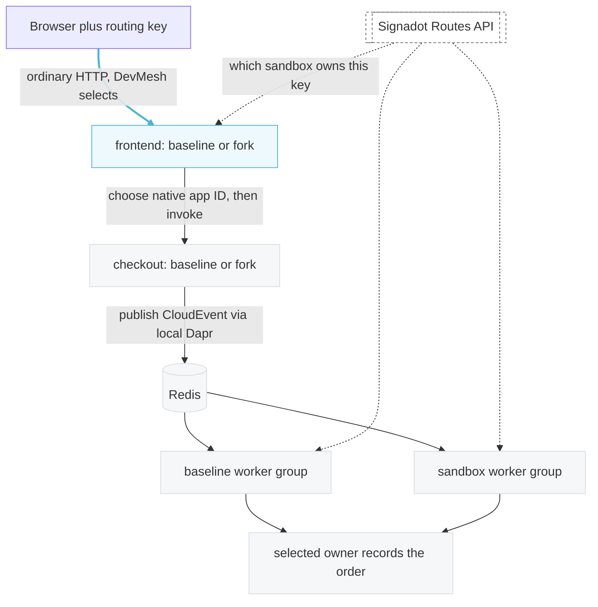

# Dapr Service Sandbox Integration Example

Dapr hides the routing key inside an encrypted message between sidecars, so Signadot cannot route
that hop for you. This example shows how to test a changed Dapr service against a shared baseline
anyway, across both service invocation and pub/sub, without giving up Dapr's native mTLS.

For the guided step-by-step walkthrough, see the
[full tutorial](https://www.signadot.com/docs/tutorials/testing-dapr-services).

## Quick Start

### Prerequisites

- A local **Minikube** profile with the
  [Signadot Operator installed](https://www.signadot.com/docs/getting-started/installation). This
  example opts its own workloads into DevMesh; nothing extra to install.
- **Dapr 1.18** with mTLS enabled, and a default persistent-volume storage class
- The [Signadot CLI](https://www.signadot.com/docs/reference/cli) installed and authenticated
- `kubectl`, Docker, `minikube`, and Python 3.12

This example does not install or alter either control plane.

### Deploy

Run these from this directory:

```bash
docker build -t dapr-signadot-tutorial:local app
minikube image load dapr-signadot-tutorial:local

python3 scripts/tutorial.py \
  --context minikube --cluster minikube \
  --name dapr-demo --namespace dapr-demo doctor

python3 scripts/tutorial.py \
  --context minikube --cluster minikube \
  --name dapr-demo --namespace dapr-demo \
  --image dapr-signadot-tutorial:local up
```

`doctor` is read-only and checks the cluster before anything is created; it ends with a single
`OK: ...` verdict line after its JSON report. `up` finishes with `phase: ready` and prints the
preview URLs; run `status` to see them again.

Three things catch people out. Flags go **before** the subcommand. Use a fresh image tag when you
rebuild, or `IfNotPresent` will quietly reuse the old code. And `--cluster` takes the Signadot
cluster name for this profile, from `signadot cluster list`, because `doctor` checks each endpoint on
its own and cannot tell you they point at the same installation.

## What you will see

Each unit costs $12.00. The checkout sandbox applies a 10% discount, and the processor sandbox marks
orders priority. The totals below are for a quantity of 3, matching the tutorial.

| Context | frontend | checkout | order-processor | Total for 3 | Fulfillment |
|---|---|---|---|---|---|
| Baseline | Baseline | Baseline | Baseline | $36.00 | Standard |
| frontend sandbox | **Fork** | Baseline | Baseline | $36.00 | Standard |
| checkout sandbox | Baseline | **Fork** | Baseline | **$32.40** | Standard |
| processor sandbox | Baseline | Baseline | **Fork** | $36.00 | **Priority** |
| Combined RouteGroup | **Fork** | **Fork** | **Fork** | **$32.40** | **Priority** |

**If the frontend column always says Baseline, check how you reached the page.** `kubectl
port-forward` arrives over loopback, which DevMesh does not intercept, so it serves the baseline
frontend no matter which key you send. Open a preview URL instead, or call the Service from a Pod
inside the cluster. Every other column is unaffected, so the port-forward is still fine for
watching checkout and the worker.

## How It Works

1. **Browser to frontend**: ordinary HTTP. Signadot routes this hop transparently, with nothing in
   `app/signadot/` involved.

2. **frontend to checkout**: Dapr carries the routing key inside an mTLS gRPC message where no proxy
   can read it. The caller asks the Routes API which sandbox owns the key, then invokes that
   workload's own Dapr app ID before the request leaves.

3. **Fork identity**: each invoked fork runs its own `daprd` with a unique app ID behind a
   selector-free `<app-id>-dapr` alias on port 50002, so the sidecar-to-sidecar hop keeps its own
   SPIFFE identity and mTLS.

4. **Checkout to worker**: no routing at all. `consumerID: "{appID}"` gives every app ID its own
   consumer group, so each worker receives every message and decides whether it owns the routing
   context before acting.

5. **Unknown keys fail loud**: when the map has never carried a key, the request is refused rather
   than quietly served from the baseline. An incomplete map and a deleted key look the same from
   here, and guessing wrong cancels someone's sandbox while still reporting success.

For the detailed mechanism and code walkthroughs, see the
[docs tutorial](https://www.signadot.com/docs/tutorials/testing-dapr-services).

## Components

| Component | Purpose |
|---|---|
| **frontend** | Order console and browser entry point, routed by Signadot |
| **checkout** | Prices an order and publishes a CloudEvent, invoked by app ID |
| **order-processor** | Subscribes to `orders`, decides ownership, records the effect |
| **app/signadot/** | The reusable adapter: Routes API client, app-ID registry, invocation wrapper, subscription guard |
| **scripts/tutorial.py** | Lifecycle: `doctor`, `up`, `reconcile`, `status`, `down` |
| **scripts/verify.py** | Live acceptance checks against a deployed namespace |
| **k8s/generated-example/** | A real run's manifests, exported verbatim |

## Platform vs. Application Code

- **Platform layer** (`app/signadot/`): Routes API client with a polling cache, app-ID registry,
  invocation wrapper, subscription guard. No pricing, fulfillment or Redis logic. Implemented once
  by the platform team. `from signadot import ...` is the stable surface.
- **Application code** (`app/checkout/`, `app/order_processor/`, `app/frontend/`): ordinary Dapr
  HTTP code. The integration points are `SignadotDaprClient.invoke` and `SubscriptionGuard.owns`.

Manifests are generated rather than checked in, because a fork's Dapr sidecar can only be built
from values the running injector holds. `k8s/generated-example/` has the verbatim output of a real
passing run so you can read it without deploying.

Those files are a record, not something to apply. The sandbox specs in them carry a
`DAPR_TRUST_ANCHORS` value, which is the public root CA certificate of the throwaway cluster that
produced them. No private key is generated, read or written anywhere in this example, and yours will
differ: the generator reads the current value from your own running injector.

## Using the adapter in your own services

`app/signadot/` is the reusable part. It talks plain HTTP to the Dapr sidecar and uses no Dapr SDK,
so it ports to any language with an HTTP client and JSON. `from signadot import ...` is the stable
surface; nothing under it carries pricing, fulfillment or Redis logic.

Wrap your Dapr client once at startup. The registry callback returns the current map of baseline
workloads to Dapr app IDs, re-read per call so a sandbox appearing or going away needs no restart:

```python
from signadot import SignadotDaprClient, Workload

integration = SignadotDaprClient(routes, dapr, registry, max_age=60, refresh_seconds=5)

response = await integration.invoke(Workload("Deployment", namespace, "checkout"), "/api/price",
                                    headers=incoming_headers, verb="POST", json=order)
```

Publishing carries the routing context onto the message, and each subscriber gates on ownership
before it reads the business payload:

```python
from signadot import AppIDs, RouteCache, RoutesClient, RoutingError, SubscriptionGuard
from signadot import cloud_event, routing_headers, routing_key, validate_cloud_event
```

The registry is one JSON document. `sandboxes` maps a Signadot sandbox name to the native Dapr app
ID that sandbox's fork runs under:

```json
{
  "namespace": "dapr-demo",
  "workloads": [
    {"baseline": {"kind": "Deployment", "namespace": "dapr-demo", "name": "checkout"},
     "baselineAppID": "checkout",
     "sandboxes": {"dapr-demo-checkout": "dapr-demo-checkout"}}
  ]
}
```

The [full tutorial](https://www.signadot.com/docs/tutorials/testing-dapr-services) walks through the
same code with the reasoning behind each step.

## Verify

```bash
python3 scripts/verify.py \
  --context minikube --namespace dapr-demo --name dapr-demo \
  --output .state/dapr-demo/evidence/acceptance.json
```

This runs nine checks against the deployed namespace. It waits for the routing map to converge,
walks all five contexts, reads frontend identity from inside the cluster rather than over a
port-forward, and then pushes on the edges: duplicate publishes, a transient failure that succeeds
on retry, a poison message, an incompatible schema that only its owner should reject, and a
malformed routing key. It finishes by inspecting every worker Pod directly to confirm the
non-owning group recorded nothing at all.

A failed assertion exits nonzero and leaves its results behind in the output file.

Runtime dependencies are pinned by hash in `app/requirements.lock`.

## Cleanup

```bash
python3 scripts/tutorial.py \
  --context minikube --cluster minikube \
  --name dapr-demo --namespace dapr-demo down
```

`down` deletes the RouteGroup and sandboxes, then the namespace including the Redis volume, and
refuses to touch resources it does not own. Use `reconcile` after the operator recreates a fork's
Deployment: it re-reads the live sandboxes and repairs the ExternalName aliases and the routing-key
ConfigMap, and is a no-op when nothing has drifted.

## Architecture



The highlighted hop at the top is the only one Signadot routes for you, and it does that the way it
does for any HTTP service. Everything below it the application routes itself, because Dapr carries the routing key
inside an encrypted sidecar-to-sidecar message. There the application resolves the destination
before invoking, and each worker decides for itself whether it owns an event.
